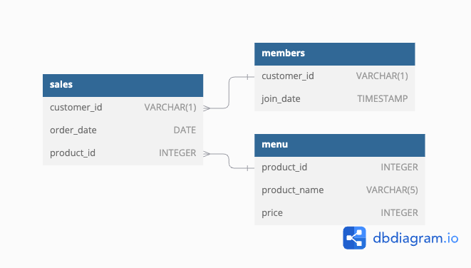

# 8 Week SQL Challenge by Danny Ma
The goal of the 8 Week SQL Challenge is to cover all the main use cases of the SQL domain in a weekly breakdown. Besides practice, I find it particularly good for learning purposes. This is why I decided to complete this challenge and add the results to my portfolio.

## Week 1 - Danny's Diner


### Introduction
Danny seriously loves Japanese food so in the beginning of 2021, he decides to embark upon a risky venture and opens up a cute little restaurant that sells his 3 favourite foods: sushi, curry and ramen.

Danny’s Diner is in need of your assistance to help the restaurant stay afloat - the restaurant has captured some very basic data from their few months of operation but have no idea how to use their data to help them run the business.

### Problem statement
Danny wants to use the data to answer a few simple questions about his customers, especially about their visiting patterns, how much money they’ve spent and also which menu items are their favourite. Having this deeper connection with his customers will help him deliver a better and more personalised experience for his loyal customers.

He plans on using these insights to help him decide whether he should expand the existing customer loyalty program - additionally he needs help to generate some basic datasets so his team can easily inspect the data without needing to use SQL.

Danny has provided you with a sample of his overall customer data due to privacy issues - but he hopes that these examples are enough for you to write fully functioning SQL queries to help him answer his questions!

### Database
#### Entity Relationship Diagram


As visualized on the diagram and written above, the database consists of 3 tables: sales, members, and menu. The primary connecting variables are customer_id and product_id, these are going to play a crucial role in conducting the queries.

## Solution
### Step 1: Getting hold of the database from [DB-Fiddle](https://www.db-fiddle.com/f/2rM8RAnq7h5LLDTzZiRWcd/138)
```sql
CREATE SCHEMA dannys_diner;
SET search_path = dannys_diner;

CREATE TABLE sales (
  "customer_id" VARCHAR(1),
  "order_date" DATE,
  "product_id" INTEGER
);

INSERT INTO sales
  ("customer_id", "order_date", "product_id")
VALUES
  ('A', '2021-01-01', '1'),
  ('A', '2021-01-01', '2'),
  ('A', '2021-01-07', '2'),
  ('A', '2021-01-10', '3'),
  ('A', '2021-01-11', '3'),
  ('A', '2021-01-11', '3'),
  ('B', '2021-01-01', '2'),
  ('B', '2021-01-02', '2'),
  ('B', '2021-01-04', '1'),
  ('B', '2021-01-11', '1'),
  ('B', '2021-01-16', '3'),
  ('B', '2021-02-01', '3'),
  ('C', '2021-01-01', '3'),
  ('C', '2021-01-01', '3'),
  ('C', '2021-01-07', '3');
 

CREATE TABLE menu (
  "product_id" INTEGER,
  "product_name" VARCHAR(5),
  "price" INTEGER
);

INSERT INTO menu
  ("product_id", "product_name", "price")
VALUES
  ('1', 'sushi', '10'),
  ('2', 'curry', '15'),
  ('3', 'ramen', '12');
  

CREATE TABLE members (
  "customer_id" VARCHAR(1),
  "join_date" DATE
);

INSERT INTO members
  ("customer_id", "join_date")
VALUES
  ('A', '2021-01-07'),
  ('B', '2021-01-09');
```

### Question 1: What is the total amount each customer spent at the restaurant?
```sql
SELECT sales.customer_id, 
	SUM(menu.price) AS total_spent
FROM dannys_diner.sales
INNER JOIN dannys_diner.menu
	ON sales.product_id = menu.product_id
GROUP BY sales.customer_id
ORDER BY total_spent ASC;
```

|  | customer_id  | total_spent   |
|--|--------------|---------------|
| 1| C            | 36            |
| 2| B            | 74            |
| 3| A            | 76            |

### Question 2: How many days has each customer visited the restaurant?
```sql
SELECT customer_id, 
	COUNT(DISTINCT order_date) 
FROM dannys_diner.sales
GROUP BY customer_id;
```

|  | customer_id  | count  	  |
|--|--------------|---------------|
| 1| A            | 4             |
| 2| B            | 6             |
| 3| C            | 2             |

### Question 3: What was the first item from the menu purchased by each customer?
```sql
WITH merged_purchases AS (
SELECT sales.customer_id,
	sales.order_date,
	menu.product_name,
	DENSE_RANK() OVER (PARTITION BY sales.customer_id ORDER BY sales.order_date) AS row_num
FROM dannys_diner.sales
INNER JOIN dannys_diner.menu
	ON sales.product_id = menu.product_id
)

SELECT customer_id,
	product_name
FROM merged_purchases
WHERE row_num = 1
GROUP BY customer_id, product_name;
```

|  | customer_id  | count  	  |
|--|--------------|---------------|
| 1| A            | curry         |
| 2| A            | sushi         |
| 3| B            | curry         |
| 4| C		  | ramen         |

### Question 4: What is the most purchased item on the menu and how many times was it purchased by all customers?
```sql
SELECT product_name, COUNT(product_name) AS times_purchased FROM dannys_diner.menu
INNER JOIN dannys_diner.sales
	ON menu.product_id = sales.product_id
GROUP BY product_name
ORDER BY times_purchased DESC
LIMIT 1;
```

|  | product_name | purchased  	  |
|--|--------------|---------------|
| 1| ramen        | 8             |

### Question 5: Which item was the most popular for each customer?
```sql
WITH most_popular AS (
	SELECT sales.customer_id,
			menu.product_name,
			COUNT(menu.product_id),
			DENSE_RANK() OVER (PARTITION BY sales.customer_id ORDER BY COUNT(sales.customer_id) DESC) as purchase_rank
	FROM dannys_diner.sales
	INNER JOIN dannys_diner.menu
		ON sales.product_id = menu.product_id
	GROUP BY sales.customer_id, menu.product_name
)

SELECT customer_id,
		product_name,
		count
FROM most_popular
WHERE purchase_rank = 1
ORDER BY customer_id
```

|  | customer_id  | product_name  | count  |
|--|--------------|---------------|--------|
| 1| A            | ramen         | 3      |
| 2| B            | sushi         | 2      | 
| 3| B            | curry         | 2      |
| 4| B		  | ramen         | 2      |
| 5| C		  | ramen         | 3      |

### Question 6: Which item was purchased first by the customer after they became a member?
```sql
WITH join_date AS(
	SELECT
		members.customer_id,
		sales.product_id,
		ROW_NUMBER() OVER (PARTITION BY members.customer_id ORDER BY sales.order_date) AS row_number
	FROM dannys_diner.members
	INNER JOIN dannys_diner.sales
		ON members.customer_id = sales.customer_id
		AND sales.order_date > members.join_date
)

SELECT 
	customer_id,
	menu.product_name
FROM join_date
INNER JOIN dannys_diner.menu
	ON join_date.product_id = menu.product_id
WHERE row_number = 1
ORDER BY customer_id ASC;
```

|  | customer_id  | product_name  |
|--|--------------|---------------|
| 1| A	          | ramen         |
| 2| B	          | sushi         |

### Question 7: Which item was purchased just before the customer became a member?
```sql
WITH premember_purchases AS (
	SELECT 
		members.customer_id,
		sales.product_id,
	ROW_NUMBER() OVER(PARTITION BY members.customer_id ORDER BY sales.order_date DESC) as ranking
	FROM dannys_diner.members
	INNER JOIN dannys_diner.sales
		ON members.customer_id = sales.customer_id
	AND sales.order_date < members.join_date
)

SELECT
	customer_id,
	menu.product_name
FROM premember_purchases
INNER JOIN dannys_diner.menu
	ON premember_purchases.product_id = menu.product_id
WHERE ranking = 1
ORDER BY customer_id ASC;
```

|  | customer_id  | product_name  |
|--|--------------|---------------|
| 1| A	          | sushi         |
| 2| B	          | sushi         |

### Question 8: What is the total items and amount spent for each member before they became a member?
```sql
SELECT
	sales.customer_id,
	COUNT(sales.product_id) AS num_products,
	SUM(menu.price) AS sum_sales
FROM dannys_diner.sales
INNER JOIN dannys_diner.menu
	ON sales.product_id = menu.product_id
INNER JOIN dannys_diner.members
	ON sales.customer_id = members.customer_id
	AND sales.order_date < members.join_date
GROUP BY sales.customer_id
ORDER BY customer_id ASC;
```

|  | customer_id  | num_products  |amount_spent |
|--|--------------|---------------|-------------|
| 1| A	          | 2             | 25  	|
| 2| B	          | 3             | 40  	|

### Question 9: If each $1 spent equates to 10 points and sushi has a 2x points multiplier — how many points would each customer have?
```sql
WITH points_CTE AS(
	SELECT 
		menu.product_id,
		CASE
			WHEN product_id = 1 THEN price * 20
			ELSE price * 10 END AS points
	FROM dannys_diner.menu
)

SELECT
	sales.customer_id,
	SUM(points_CTE.points)
FROM dannys_diner.sales
INNER JOIN points_CTE
	ON sales.product_id = points_CTE.product_id
GROUP BY customer_id
ORDER BY customer_id ASC;
```

|  | customer_id  | sum_points    |
|--|--------------|---------------|
| 1| A	          | 860           |
| 2| B	          | 940           |
| 3| C	          | 360           |

### Question 10: In the first week after a customer joins the program (including their join date) they earn 2x points on all items, not just sushi — how many points do customer A and B have at the end of January?
```sql
WITH dates_CTE AS (
	SELECT 
		members.customer_id,
		join_date,
		join_date + 6 AS closing_day,
		DATE_TRUNC(
			'month', '2021-01-31'::DATE)
			+ interval '1 month'
			- interval '1 day' AS end_of_jan
	FROM dannys_diner.members
)

SELECT 
	sales.customer_id,
	SUM(CASE
			WHEN menu.product_id = 1 THEN menu.price * 20
			WHEN sales.order_date BETWEEN dates_CTE.join_date AND dates_CTE.closing_day THEN menu.price * 20
			ELSE menu.price * 10 END) AS total_points
FROM dannys_diner.sales
INNER JOIN dates_CTE
	ON sales.customer_id = dates_CTE.customer_id
	AND dates_CTE.join_date <= sales.order_date
	AND sales.order_date <= dates_CTE.end_of_jan
INNER JOIN dannys_diner.menu
	ON sales.product_id = menu.product_id
GROUP BY sales.customer_id
ORDER BY customer_id ASC;
```

|  | customer_id  | total_points  |
|--|--------------|---------------|
| 1| A	          | 1020          |
| 2| B	          | 320           |

### Bonus 1: Join All The Things
The following questions are related creating basic data tables that Danny and his team can use to quickly derive insights without needing to join the underlying tables using SQL.

Recreate the following table output using the available data:
| customer_id   | order_date   | product_name   |   price | member   |
|:--------------|:-------------|:---------------|--------:|:---------|
| A             | 2021-01-01   | curry          |      15 | N        |
| A             | 2021-01-01   | sushi          |      10 | N        |
| A             | 2021-01-07   | curry          |      15 | Y        |
| A             | 2021-01-10   | ramen          |      12 | Y        |
| A             | 2021-01-11   | ramen          |      12 | Y        |
| A             | 2021-01-11   | ramen          |      12 | Y        |
| B             | 2021-01-01   | curry          |      15 | N        |
| B             | 2021-01-02   | curry          |      15 | N        |
| B             | 2021-01-04   | sushi          |      10 | N        |
| B             | 2021-01-11   | sushi          |      10 | Y        |
| B             | 2021-01-16   | ramen          |      12 | Y        |
| B             | 2021-02-01   | ramen          |      12 | Y        |
| C             | 2021-01-01   | ramen          |      12 | N        |
| C             | 2021-01-01   | ramen          |      12 | N        |
| C             | 2021-01-07   | ramen          |      12 | N        |

```sql
SELECT 
	sales.customer_id,
	sales.order_date,
	menu.product_name,
	menu.price,
	CASE
		WHEN members.join_date > sales.order_date THEN 'N'
		WHEN members.join_date <= sales.order_date THEN 'Y'
		ELSE 'N' END AS membership
FROM dannys_diner.sales
INNER JOIN dannys_diner.menu
	ON sales.product_id = menu.product_id
LEFT JOIN dannys_diner.members
	ON sales.customer_id = members.customer_id
ORDER BY customer_id, order_date;
```

| customer_id   | order_date   | product_name   |   price | member   |
|:--------------|:-------------|:---------------|--------:|:---------|
| A             | 2021-01-01   | curry          |      15 | N        |
| A             | 2021-01-01   | sushi          |      10 | N        |
| A             | 2021-01-07   | curry          |      15 | Y        |
| A             | 2021-01-10   | ramen          |      12 | Y        |
| A             | 2021-01-11   | ramen          |      12 | Y        |
| A             | 2021-01-11   | ramen          |      12 | Y        |
| B             | 2021-01-01   | curry          |      15 | N        |
| B             | 2021-01-02   | curry          |      15 | N        |
| B             | 2021-01-04   | sushi          |      10 | N        |
| B             | 2021-01-11   | sushi          |      10 | Y        |
| B             | 2021-01-16   | ramen          |      12 | Y        |
| B             | 2021-02-01   | ramen          |      12 | Y        |
| C             | 2021-01-01   | ramen          |      12 | N        |
| C             | 2021-01-01   | ramen          |      12 | N        |
| C             | 2021-01-07   | ramen          |      12 | N        |

### Bonus 2: Rank All The Things
Danny also requires further information about the ranking of customer products, but he purposely does not need the ranking for non-member purchases so he expects null ranking values for the records when customers are not yet part of the loyalty program

```sql
WITH base_CTE AS(
	SELECT 
		sales.customer_id,
		sales.order_date,
		menu.product_name,
		menu.price,
		CASE
			WHEN members.join_date > sales.order_date THEN 'N'
			WHEN members.join_date <= sales.order_date THEN 'Y'
			ELSE 'N' END AS membership
	FROM dannys_diner.sales
	INNER JOIN dannys_diner.menu
		ON sales.product_id = menu.product_id
	LEFT JOIN dannys_diner.members
		ON sales.customer_id = members.customer_id
	ORDER BY customer_id, order_date
)

SELECT 
	*,
	CASE
		WHEN membership = 'N' THEN NULL
		ELSE DENSE_RANK() OVER (PARTITION BY customer_id, membership ORDER BY order_date) END AS ranking
FROM base_CTE;
```

| customer_id   | order_date   | product_name   |   price | member   |   rank |
|:--------------|:-------------|:---------------|--------:|:---------|-------:|
| A             | 2021-01-01   | sushi          |      10 | N        |    nan |
| A             | 2021-01-01   | curry          |      15 | N        |    nan |
| A             | 2021-01-07   | curry          |      15 | Y        |      1 |
| A             | 2021-01-10   | ramen          |      12 | Y        |      2 |
| A             | 2021-01-11   | ramen          |      12 | Y        |      3 |
| A             | 2021-01-11   | ramen          |      12 | Y        |      3 |
| B             | 2021-01-01   | curry          |      15 | N        |    nan |
| B             | 2021-01-02   | curry          |      15 | N        |    nan |
| B             | 2021-01-04   | sushi          |      10 | N        |    nan |
| B             | 2021-01-11   | sushi          |      10 | Y        |      1 |
| B             | 2021-01-16   | ramen          |      12 | Y        |      2 |
| B             | 2021-02-01   | ramen          |      12 | Y        |      3 |
| C             | 2021-01-01   | ramen          |      12 | N        |    nan |
| C             | 2021-01-01   | ramen          |      12 | N        |    nan |
| C             | 2021-01-07   | ramen          |      12 | N        |    nan |

