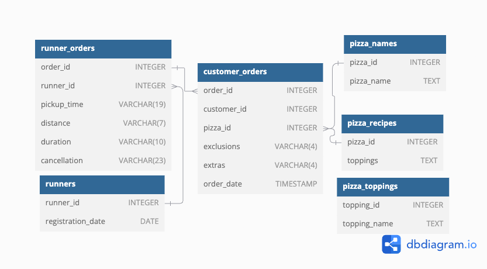

## Week 2/A - Pizza Metrics


### Introduction
Did you know that over 115 million kilograms of pizza is consumed daily worldwide??? (Well according to Wikipedia anyway…)

Danny was scrolling through his Instagram feed when something really caught his eye - “80s Retro Styling and Pizza Is The Future!”

Danny was sold on the idea, but he knew that pizza alone was not going to help him get seed funding to expand his new Pizza Empire - so he had one more genius idea to combine with it - he was going to Uberize it - and so Pizza Runner was launched!

Danny started by recruiting “runners” to deliver fresh pizza from Pizza Runner Headquarters (otherwise known as Danny’s house) and also maxed out his credit card to pay freelance developers to build a mobile app to accept orders from customers.

### Database
#### Entity Relationship Diagram


As visualized on the diagram and written above, the database consists of 6 tables: runner_orders, runners, customer_orders, pizza_names, pizza_recipes, and pizza_toppings. The primary connecting variables are customer_id, order_id, runner_id, pizza_id, and topping_id. These are going to play a crucial role in conducting the queries.

## Solution
### Step 1: Getting hold of the database from [DB-Fiddle](https://www.db-fiddle.com/f/2rM8RAnq7h5LLDTzZiRWcd/138)
```sql
CREATE SCHEMA pizza_runner;
SET search_path = pizza_runner;

DROP TABLE IF EXISTS runners;
CREATE TABLE runners (
  "runner_id" INTEGER,
  "registration_date" DATE
);
INSERT INTO runners
  ("runner_id", "registration_date")
VALUES
  (1, '2021-01-01'),
  (2, '2021-01-03'),
  (3, '2021-01-08'),
  (4, '2021-01-15');


DROP TABLE IF EXISTS customer_orders;
CREATE TABLE customer_orders (
  "order_id" INTEGER,
  "customer_id" INTEGER,
  "pizza_id" INTEGER,
  "exclusions" VARCHAR(4),
  "extras" VARCHAR(4),
  "order_time" TIMESTAMP
);

INSERT INTO customer_orders
  ("order_id", "customer_id", "pizza_id", "exclusions", "extras", "order_time")
VALUES
  ('1', '101', '1', '', '', '2020-01-01 18:05:02'),
  ('2', '101', '1', '', '', '2020-01-01 19:00:52'),
  ('3', '102', '1', '', '', '2020-01-02 23:51:23'),
  ('3', '102', '2', '', NULL, '2020-01-02 23:51:23'),
  ('4', '103', '1', '4', '', '2020-01-04 13:23:46'),
  ('4', '103', '1', '4', '', '2020-01-04 13:23:46'),
  ('4', '103', '2', '4', '', '2020-01-04 13:23:46'),
  ('5', '104', '1', 'null', '1', '2020-01-08 21:00:29'),
  ('6', '101', '2', 'null', 'null', '2020-01-08 21:03:13'),
  ('7', '105', '2', 'null', '1', '2020-01-08 21:20:29'),
  ('8', '102', '1', 'null', 'null', '2020-01-09 23:54:33'),
  ('9', '103', '1', '4', '1, 5', '2020-01-10 11:22:59'),
  ('10', '104', '1', 'null', 'null', '2020-01-11 18:34:49'),
  ('10', '104', '1', '2, 6', '1, 4', '2020-01-11 18:34:49');


DROP TABLE IF EXISTS runner_orders;
CREATE TABLE runner_orders (
  "order_id" INTEGER,
  "runner_id" INTEGER,
  "pickup_time" VARCHAR(19),
  "distance" VARCHAR(7),
  "duration" VARCHAR(10),
  "cancellation" VARCHAR(23)
);

INSERT INTO runner_orders
  ("order_id", "runner_id", "pickup_time", "distance", "duration", "cancellation")
VALUES
  ('1', '1', '2020-01-01 18:15:34', '20km', '32 minutes', ''),
  ('2', '1', '2020-01-01 19:10:54', '20km', '27 minutes', ''),
  ('3', '1', '2020-01-03 00:12:37', '13.4km', '20 mins', NULL),
  ('4', '2', '2020-01-04 13:53:03', '23.4', '40', NULL),
  ('5', '3', '2020-01-08 21:10:57', '10', '15', NULL),
  ('6', '3', 'null', 'null', 'null', 'Restaurant Cancellation'),
  ('7', '2', '2020-01-08 21:30:45', '25km', '25mins', 'null'),
  ('8', '2', '2020-01-10 00:15:02', '23.4 km', '15 minute', 'null'),
  ('9', '2', 'null', 'null', 'null', 'Customer Cancellation'),
  ('10', '1', '2020-01-11 18:50:20', '10km', '10minutes', 'null');


DROP TABLE IF EXISTS pizza_names;
CREATE TABLE pizza_names (
  "pizza_id" INTEGER,
  "pizza_name" TEXT
);
INSERT INTO pizza_names
  ("pizza_id", "pizza_name")
VALUES
  (1, 'Meatlovers'),
  (2, 'Vegetarian');


DROP TABLE IF EXISTS pizza_recipes;
CREATE TABLE pizza_recipes (
  "pizza_id" INTEGER,
  "toppings" TEXT
);
INSERT INTO pizza_recipes
  ("pizza_id", "toppings")
VALUES
  (1, '1, 2, 3, 4, 5, 6, 8, 10'),
  (2, '4, 6, 7, 9, 11, 12');


DROP TABLE IF EXISTS pizza_toppings;
CREATE TABLE pizza_toppings (
  "topping_id" INTEGER,
  "topping_name" TEXT
);
INSERT INTO pizza_toppings
  ("topping_id", "topping_name")
VALUES
  (1, 'Bacon'),
  (2, 'BBQ Sauce'),
  (3, 'Beef'),
  (4, 'Cheese'),
  (5, 'Chicken'),
  (6, 'Mushrooms'),
  (7, 'Onions'),
  (8, 'Pepperoni'),
  (9, 'Peppers'),
  (10, 'Salami'),
  (11, 'Tomatoes'),
  (12, 'Tomato Sauce');
```

Before diving into the questions, Danny gave some hints about 2 tables, `customer_orders` and `runner_orders`. After a quick query, it became clear that there are multiple columns that are not in the correct data type and there are `NULL` values that are stored as strings. First, let us tackle these issues.

### NULL values
```sql
UPDATE pizza_runner.customer_orders
SET exclusions = NULL
WHERE exclusions = 'null';

UPDATE pizza_runner.customer_orders
SET extras = NULL
WHERE extras = 'null';

UPDATE pizza_runner.customer_orders
SET exclusions = NULL
WHERE exclusions = '';

UPDATE pizza_runner.customer_orders
SET extras = NULL
WHERE extras = '';

UPDATE pizza_runner.runner_orders
SET pickup_time = NULL
WHERE pickup_time = 'null';

UPDATE pizza_runner.runner_orders
SET distance= NULL
WHERE distance = 'null';

UPDATE pizza_runner.runner_orders
SET duration = NULL
WHERE duration = 'null';

UPDATE pizza_runner.runner_orders
SET cancellation = NULL
WHERE cancellation = 'null';

UPDATE pizza_runner.runner_orders
SET cancellation = NULL
WHERE cancellation = '';
```

### Data types
```sql
ALTER TABLE pizza_runner.customer_orders
ALTER COLUMN exclusions TYPE INTEGER;

UPDATE pizza_runner.customer_orders
SET exclusions = string_to_array(exclusions, ', ')::INTEGER[]
WHERE exclusions IS NOT NULL;

ALTER TABLE pizza_runner.customer_orders
ALTER COLUMN extras TYPE TEXT;

UPDATE pizza_runner.customer_orders
SET extras = string_to_array(extras, ', ')::INTEGER[]
WHERE extras IS NOT NULL;

UPDATE pizza_runner.runner_orders
SET distance = TRIM(REGEXP_REPLACE(distance, '[^0-9.]+', ''))
WHERE distance IS NOT NULL;

ALTER TABLE pizza_runner.runner_orders
ALTER COLUMN distance TYPE FLOAT
USING distance::FLOAT

UPDATE pizza_runner.runner_orders
SET duration = TRIM(REGEXP_REPLACE(duration, '[^0-9]+', ''))
WHERE duration IS NOT NULL;

ALTER TABLE pizza_runner.runner_orders
ALTER COLUMN duration TYPE FLOAT
USING duration::FLOAT
```
After running these queries, all columns have been cleaned, so the solving process can be started.

### Question 1: How many pizzas were ordered?
As starting off, a simple query can answer this question. All I had to do was to use `COUNT()` on `order_id` to see the total number of orders.

```sql
SELECT 
	COUNT(order_id) AS total_orders 
FROM pizza_runner.customer_orders;
```

|  | total_orders |
|--|--------------|
| 1| 14           |

### Question 2: How many unique customer orders were made?
For this question, instead of only counting every `order_id`, I counted the unique ones using `DISTINCT`.

```sql
SELECT 
	COUNT(DISTINCT order_id) AS unique_orders 
FROM pizza_runner.customer_orders;
```

|  | unique_orders |
|--|---------------|
| 1| 10            |

### Question 3: 


```sql

```

|  | -  | -  	  |
|--|--------------|---------------|
| 1| -            | -         |
| 2| -            | -         |
| 3| -            | -         |
| 4| -		  | -         |

### Question 4: 

```sql

```

|  | - | -  	  |
|--|--------------|---------------|
| 1| -        | -             |

### Question 5: 

```sql

```

|  | -  | -  | -  |
|--|--------------|---------------|--------|
| 1| -            | -         | -      |
| 2| -            | -         | -      | 
| 3| -            | -         | -      |
| 4| -		  | -         | -      |
| 5| -		  | -         | -      |

### Question 6: 


```sql

```

|  | -  | -  |
|--|--------------|---------------|
| 1| -	          | -         |
| 2| -	          | -         |

### Question 7: 


```sql

```

|  |   |   |
|--|--------------|---------------|
| 1| 	          |          |
| 2| 	          |          |

### Question 8: 


```sql

```

|  | -  | -  |- |
|--|--------------|---------------|-------------|
| 1| -	          | -             | -  	|
| 2| -	          | -             | -  	|

### Question 9: 


```sql

```

|  | -  | -    |
|--|--------------|---------------|
| 1| -	          | -           |
| 2| -	          | -           |
| 3| -	          | -           |

### Question 10: 


```sql

```

|  | -  | -  |
|--|--------------|---------------|
| 1| -	          | -          |
| 2| -	          | -           |


