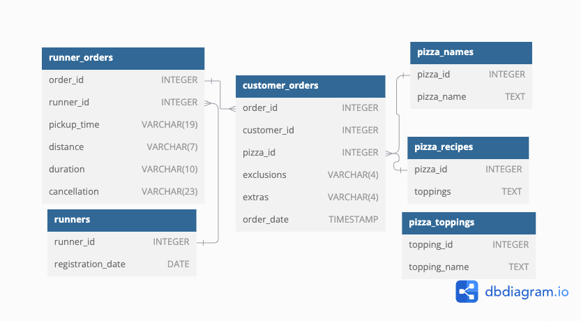

## Week 2/C - Ingredient Optimisation


### Introduction
Did you know that over 115 million kilograms of pizza is consumed daily worldwide??? (Well according to Wikipedia anyway…)

Danny was scrolling through his Instagram feed when something really caught his eye - “80s Retro Styling and Pizza Is The Future!”

Danny was sold on the idea, but he knew that pizza alone was not going to help him get seed funding to expand his new Pizza Empire - so he had one more genius idea to combine with it - he was going to Uberize it - and so Pizza Runner was launched!

Danny started by recruiting “runners” to deliver fresh pizza from Pizza Runner Headquarters (otherwise known as Danny’s house) and also maxed out his credit card to pay freelance developers to build a mobile app to accept orders from customers.

### Database
#### Entity Relationship Diagram


As visualized on the diagram and written above, the database consists of 6 tables: runner_orders, runners, customer_orders, pizza_names, pizza_recipes, and pizza_toppings. The primary connecting variables are customer_id, order_id, runner_id, pizza_id, and topping_id. These are going to play a crucial role in conducting the queries.

## Solution
### Step 1: Getting hold of the database from [DB-Fiddle](https://www.db-fiddle.com/f/2rM8RAnq7h5LLDTzZiRWcd/138)

<details>
  <summary>Click to expand SQL script</summary>

```sql
CREATE SCHEMA pizza_runner;
SET search_path = pizza_runner;

DROP TABLE IF EXISTS runners;
CREATE TABLE runners (
  "runner_id" INTEGER,
  "registration_date" DATE
);
INSERT INTO runners
  ("runner_id", "registration_date")
VALUES
  (1, '2021-01-01'),
  (2, '2021-01-03'),
  (3, '2021-01-08'),
  (4, '2021-01-15');


DROP TABLE IF EXISTS customer_orders;
CREATE TABLE customer_orders (
  "order_id" INTEGER,
  "customer_id" INTEGER,
  "pizza_id" INTEGER,
  "exclusions" VARCHAR(4),
  "extras" VARCHAR(4),
  "order_time" TIMESTAMP
);

INSERT INTO customer_orders
  ("order_id", "customer_id", "pizza_id", "exclusions", "extras", "order_time")
VALUES
  ('1', '101', '1', '', '', '2020-01-01 18:05:02'),
  ('2', '101', '1', '', '', '2020-01-01 19:00:52'),
  ('3', '102', '1', '', '', '2020-01-02 23:51:23'),
  ('3', '102', '2', '', NULL, '2020-01-02 23:51:23'),
  ('4', '103', '1', '4', '', '2020-01-04 13:23:46'),
  ('4', '103', '1', '4', '', '2020-01-04 13:23:46'),
  ('4', '103', '2', '4', '', '2020-01-04 13:23:46'),
  ('5', '104', '1', 'null', '1', '2020-01-08 21:00:29'),
  ('6', '101', '2', 'null', 'null', '2020-01-08 21:03:13'),
  ('7', '105', '2', 'null', '1', '2020-01-08 21:20:29'),
  ('8', '102', '1', 'null', 'null', '2020-01-09 23:54:33'),
  ('9', '103', '1', '4', '1, 5', '2020-01-10 11:22:59'),
  ('10', '104', '1', 'null', 'null', '2020-01-11 18:34:49'),
  ('10', '104', '1', '2, 6', '1, 4', '2020-01-11 18:34:49');


DROP TABLE IF EXISTS runner_orders;
CREATE TABLE runner_orders (
  "order_id" INTEGER,
  "runner_id" INTEGER,
  "pickup_time" VARCHAR(19),
  "distance" VARCHAR(7),
  "duration" VARCHAR(10),
  "cancellation" VARCHAR(23)
);

INSERT INTO runner_orders
  ("order_id", "runner_id", "pickup_time", "distance", "duration", "cancellation")
VALUES
  ('1', '1', '2020-01-01 18:15:34', '20km', '32 minutes', ''),
  ('2', '1', '2020-01-01 19:10:54', '20km', '27 minutes', ''),
  ('3', '1', '2020-01-03 00:12:37', '13.4km', '20 mins', NULL),
  ('4', '2', '2020-01-04 13:53:03', '23.4', '40', NULL),
  ('5', '3', '2020-01-08 21:10:57', '10', '15', NULL),
  ('6', '3', 'null', 'null', 'null', 'Restaurant Cancellation'),
  ('7', '2', '2020-01-08 21:30:45', '25km', '25mins', 'null'),
  ('8', '2', '2020-01-10 00:15:02', '23.4 km', '15 minute', 'null'),
  ('9', '2', 'null', 'null', 'null', 'Customer Cancellation'),
  ('10', '1', '2020-01-11 18:50:20', '10km', '10minutes', 'null');


DROP TABLE IF EXISTS pizza_names;
CREATE TABLE pizza_names (
  "pizza_id" INTEGER,
  "pizza_name" TEXT
);
INSERT INTO pizza_names
  ("pizza_id", "pizza_name")
VALUES
  (1, 'Meatlovers'),
  (2, 'Vegetarian');


DROP TABLE IF EXISTS pizza_recipes;
CREATE TABLE pizza_recipes (
  "pizza_id" INTEGER,
  "toppings" TEXT
);
INSERT INTO pizza_recipes
  ("pizza_id", "toppings")
VALUES
  (1, '1, 2, 3, 4, 5, 6, 8, 10'),
  (2, '4, 6, 7, 9, 11, 12');


DROP TABLE IF EXISTS pizza_toppings;
CREATE TABLE pizza_toppings (
  "topping_id" INTEGER,
  "topping_name" TEXT
);
INSERT INTO pizza_toppings
  ("topping_id", "topping_name")
VALUES
  (1, 'Bacon'),
  (2, 'BBQ Sauce'),
  (3, 'Beef'),
  (4, 'Cheese'),
  (5, 'Chicken'),
  (6, 'Mushrooms'),
  (7, 'Onions'),
  (8, 'Pepperoni'),
  (9, 'Peppers'),
  (10, 'Salami'),
  (11, 'Tomatoes'),
  (12, 'Tomato Sauce');
```
</details>

<details>
    <summary>There is a part of data cleaning and datatype conversion, which was already discussed in Week 2/A. so I just collapsed it. Feel free to inspect tho.</summary>
  
Before diving into the questions, Danny gave some hints about 2 tables, `customer_orders` and `runner_orders`. After a quick query, it became clear that there are multiple columns that are not in the correct data type and there are `NULL` values that are stored as strings. First, let us tackle these issues.

### NULL values
```sql
UPDATE pizza_runner.customer_orders
SET exclusions = NULL
WHERE exclusions = 'null';

UPDATE pizza_runner.customer_orders
SET extras = NULL
WHERE extras = 'null';

UPDATE pizza_runner.customer_orders
SET exclusions = NULL
WHERE exclusions = '';

UPDATE pizza_runner.customer_orders
SET extras = NULL
WHERE extras = '';

UPDATE pizza_runner.runner_orders
SET pickup_time = NULL
WHERE pickup_time = 'null';

UPDATE pizza_runner.runner_orders
SET distance= NULL
WHERE distance = 'null';

UPDATE pizza_runner.runner_orders
SET duration = NULL
WHERE duration = 'null';

UPDATE pizza_runner.runner_orders
SET cancellation = NULL
WHERE cancellation = 'null';

UPDATE pizza_runner.runner_orders
SET cancellation = NULL
WHERE cancellation = '';
```

### Data types
```sql
ALTER TABLE pizza_runner.customer_orders
ALTER COLUMN exclusions TYPE INTEGER;

UPDATE pizza_runner.customer_orders
SET exclusions = string_to_array(exclusions, ', ')::INTEGER[]
WHERE exclusions IS NOT NULL;

ALTER TABLE pizza_runner.customer_orders
ALTER COLUMN extras TYPE TEXT;

UPDATE pizza_runner.customer_orders
SET extras = string_to_array(extras, ', ')::INTEGER[]
WHERE extras IS NOT NULL;

UPDATE pizza_runner.runner_orders
SET distance = TRIM(REGEXP_REPLACE(distance, '[^0-9.]+', ''))
WHERE distance IS NOT NULL;

ALTER TABLE pizza_runner.runner_orders
ALTER COLUMN distance TYPE FLOAT
USING distance::FLOAT

UPDATE pizza_runner.runner_orders
SET duration = TRIM(REGEXP_REPLACE(duration, '[^0-9]+', ''))
WHERE duration IS NOT NULL;

ALTER TABLE pizza_runner.runner_orders
ALTER COLUMN duration TYPE FLOAT
USING duration::FLOAT
```
After running these queries, all columns have been cleaned, so the solving process can be started.
</details>

### Task 0: Altering `search_path`
I am going to be blunt here, I got bored writing pizza_runner all over and over again, so I just alter the `search_path` for the actual session, which will spare me a lot of time and unnecessary effort. So even though I am not going to refer to pizza_runner again, I am going to continue using the same schema as I was thus far.

```sql
SET search_path TO pizza_runner;
```

### Question 1: What are the standard ingredients for each pizza?
At question one, I had to apply multiple new functions that have not been used before in the challenge. What I first did here was to incorporate `string_to_array(pr.toppings, ', ')::INT[]`, which transforms the original format of topping lists `1, 2 ,3 ,4, ...` to arrays `{1, 2, 3, 4, ...}`. This could be used in the `ANY()` function to be the subject of the joining. The first `JOIN` matches the ingredient ids in `pizza_toppings` with the freshly created arrays. Then `STRING_AGG(pt.topping_name, ', ')` is responsible for concatenating the initial ingredients to string (e.g. `Mushroom, Pepperoni, Tomato`).

```sql
SELECT
    pn.pizza_name,
    STRING_AGG(pt.topping_name, ', ') AS standard_ingredients
FROM pizza_recipes AS pr
JOIN pizza_toppings AS pt
	ON pt.topping_id = ANY(string_to_array(pr.toppings, ', ')::INT[])
JOIN pizza_names AS pn
	ON pr.pizza_id = pn.pizza_id
GROUP BY pizza_name;
```

|  | pizza_name | standard_ingredients |
|--|--------------|---------|
| 1| Meatlovers           | Bacon, BBQ Sauce, Beef, Cheese, Chicken, Mushrooms, Pepperoni, Salami         |
| 2| Vegetarian           | Cheese, Mushrooms, Onions, Peppers, Tomatoes, Tomato Sauce        |

### Question 2: What was the most commonly added extra?
In this question, the same `JOIN` approach is used as for Question 1, but without using `string_to_array`, since I previously did the due diligence regarding the data cleaning & data type conversion. All I did was counting the times each `topping_id` appeared and paired the with their respective names.

```sql
SELECT 
	pt.topping_name,
	COUNT(topping_id) AS times_added
FROM customer_orders AS co
JOIN pizza_toppings AS pt
    ON pt.topping_id = ANY(co.extras::INT[])
WHERE co.extras IS NOT NULL
GROUP BY topping_name
ORDER BY COUNT(topping_id) DESC;
```

|  | topping_name | times_added |
|--|---------------|-----|
| 1| Bacon            |   4     |
| 2| Chicken            |    1    |
| 3| Cheese            |     1   |

### Question 3: What was the most common exclusion?
The logic is the same as for the previous question, but `extras` is switched out to `exclusions`.

```sql
SELECT 
	pt.topping_name,
	COUNT(topping_id) AS times_excluded
FROM customer_orders AS co
JOIN pizza_toppings AS pt
    ON pt.topping_id = ANY(co.exclusions::INT[])
WHERE co.exclusions IS NOT NULL
GROUP BY topping_name
ORDER BY COUNT(topping_id) DESC;
```

|  | topping_name | times_excluded  |
|--|--------------|---------------|
| 1| Cheese           | 4        |
| 2| Mushrooms           | 1         |
| 3| BBQ Sauce           | 1         |

### Question 4: Generate an order item for each record in the `customers_orders` table in the format of one of the following:
### - `Meat Lovers`
### - `Meat Lovers - Exclude Beef`
### - `Meat Lovers - Extra Bacon`
### - `Meat Lovers - Exclude Cheese, Bacon - Extra Mushroom, Peppers`
Okay, this task challenged me, and I think I am still not completely blunt here. It took me an enormously long time to figure out that the only viable strategy here is to start with a separate CTE containing only the numbering of each pizza (`ROW_NUMBER() OVER (PARTITION BY co.order_id ORDER BY co.pizza_id, co.exclusions, co.extras) AS rank`). But why exactly? I was trying around for a long time with 2 CTEs, one for the exclusions and one for the extras. The only issue was that I had to use `STRING_AGG()` in any case to be able to create the necessary string concatenation, just as in Question 2. But I did not find any solution to keep each listing in an order separate, since `STRING_AGG()` of course requires `GROUP BY()`, which had to by on the level of `order_id`. To tackle this, I created a first CTE, which is only responsible for creating a `rank`, numbering each pizza in every order. Thus, later in the two other CTEs (for `exclusions` and for `extras`) I could keep using `STRING_AGG()` with grouping on rank level. In the outer query, I only had to replicate the `customer_orders` table and add a concatenation of strings displaying the asked architecture. 


```sql
WITH ranked_orders AS (
    -- Assign a unique rank to each pizza in the same order
    SELECT 
		co.*,
        pn.pizza_name,
        ROW_NUMBER() OVER (PARTITION BY co.order_id ORDER BY co.pizza_id, co.exclusions, co.extras) AS rank
    FROM customer_orders AS co
    LEFT JOIN pizza_names AS pn
        ON co.pizza_id = pn.pizza_id
),
excluded_toppings AS (
    -- Get the distinct toppings to exclude for each pizza, using the rank
    SELECT
        ro.order_id,
        ro.rank,
        COALESCE(
            STRING_AGG(DISTINCT pt.topping_name, ', '), ''
        ) AS excluded_toppings
    FROM ranked_orders AS ro
    LEFT JOIN pizza_toppings AS pt
        ON pt.topping_id = ANY(ro.exclusions::INT[])
    GROUP BY ro.order_id, ro.rank
),
extra_toppings AS (
    -- Get the distinct toppings to add as extras for each pizza, using the rank
    SELECT
        ro.order_id,
        ro.rank,
        COALESCE(
            STRING_AGG(DISTINCT pt.topping_name, ', '), ''
        ) AS extra_toppings
    FROM ranked_orders AS ro
    LEFT JOIN pizza_toppings AS pt
        ON pt.topping_id = ANY(ro.extras::INT[])
    GROUP BY ro.order_id, ro.rank
)

SELECT
    ro.order_id,
	ro.customer_id,
	ro.pizza_id,
	ro.exclusions,
	ro.extras,
	ro.order_time,
	ro.pizza_name ||
	CASE 
	    -- Handle exclusions
	    WHEN exc.excluded_toppings <> '' THEN ' - Exclude ' || exc.excluded_toppings 
	    ELSE '' 
	END ||
	CASE 
	    -- Handle extras
	    WHEN ext.extra_toppings <> '' THEN ' - Extra ' || ext.extra_toppings 
	    ELSE '' 
	END AS order_item
FROM ranked_orders AS ro
LEFT JOIN excluded_toppings AS exc
    ON ro.order_id = exc.order_id AND ro.rank = exc.rank
LEFT JOIN extra_toppings AS ext
    ON ro.order_id = ext.order_id AND ro.rank = ext.rank
ORDER BY ro.order_id, ro.rank;
```

| order_id | customer_id | pizza_id | exclusions | extras    | order_time           | order_item                                                 |
|----------|-------------|----------|------------|-----------|----------------------|------------------------------------------------------------|
| 1        | 101         | 1        |            |           | 2020-01-01 18:05:02   | Meatlovers                                                  |
| 2        | 101         | 1        |            |           | 2020-01-01 19:00:52   | Meatlovers                                                  |
| 3        | 102         | 1        |            |           | 2020-01-02 23:51:23   | Meatlovers                                                  |
| 3        | 102         | 2        |            |           | 2020-01-02 23:51:23   | Vegetarian                                                  |
| 4        | 103         | 1        | {4}        |           | 2020-01-04 13:23:46   | Meatlovers - Exclude Cheese                                 |
| 4        | 103         | 1        | {4}        |           | 2020-01-04 13:23:46   | Meatlovers - Exclude Cheese                                 |
| 4        | 103         | 2        | {4}        |           | 2020-01-04 13:23:46   | Vegetarian - Exclude Cheese                                 |
| 5        | 104         | 1        |            | {1}       | 2020-01-08 21:00:29   | Meatlovers - Extra Bacon                                    |
| 6        | 101         | 2        |            |           | 2020-01-08 21:03:13   | Vegetarian                                                  |
| 7        | 105         | 2        |            | {1}       | 2020-01-08 21:20:29   | Vegetarian - Extra Bacon                                    |
| 8        | 102         | 1        |            |           | 2020-01-09 23:54:33   | Meatlovers                                                  |
| 9        | 103         | 1        | {4}        | {1,5}     | 2020-01-10 11:22:59   | Meatlovers - Exclude Cheese - Extra Bacon, Chicken          |
| 10       | 104         | 1        | {2,6}      | {1,4}     | 2020-01-11 18:34:49   | Meatlovers - Exclude BBQ Sauce, Mushrooms - Extra Bacon, Cheese |
| 10       | 104         | 1        |            |           | 2020-01-11 18:34:49   | Meatlovers                                                  |


### Question 5: Generate an alphabetically ordered comma separated ingredient list for each pizza order from the `customer_orders` table and add a 2x in front of any relevant ingredients
Well, I am practically braindead by this point. When I read the question, I thought it is going to be a minor change to Question 4. Plot twist, it was a teeny-tiny bit more than that. I had to create a 4th and a 5th CTE, one being responsible for the pulling of the base ingredients and one being responsible for combining the base ingredients with the extras and exclusions. The way I approached this is i used `ARRAY_CAT(bi.base_ingreds, COALESCE(ext.extra_toppings, '{}')` to combine all the `topping_id`s of the base ingredients and the extra ones. Then I conducted `unnest()` to convert the array to a bunch of rows, because it is easier to handle them. The next row `WHERE topping_id_unnest <> ALL(COALESCE(exc.excluded_toppings, '{}'))` makes sure that whenever a `topping_id` is in the `excluded_toppings`, it gets removed from the main ingredients list. After this is done, the unnested bunch is converted back to an `ARRAY()`. With this series of steps, I added the extras and removed the exclusions.
In the outer query, I only pair up the respective `topping_name`s with the ids and add the `2x` prefix using `WHEN pt.topping_id = ANY(ext.extra_toppings) AND pt.topping_id = ANY(bi.base_ingreds) THEN '2x ' || pt.topping_name`. Easy Peasy, right?...

```sql
WITH ranked_orders AS (
    -- Assign a unique rank to each pizza in the same order
    SELECT 
		co.*,
        pn.pizza_name,
        ROW_NUMBER() OVER (PARTITION BY co.order_id ORDER BY co.pizza_id, co.exclusions, co.extras) AS rank
    FROM customer_orders AS co
    LEFT JOIN pizza_names AS pn
        ON co.pizza_id = pn.pizza_id
),
excluded_toppings AS (
    -- Get the distinct toppings to exclude for each pizza, using the rank
    SELECT
        ro.order_id,
        ro.rank,
        COALESCE(
            ARRAY_AGG(DISTINCT pt.topping_id), '{}'::INT[]
        ) AS excluded_toppings
    FROM ranked_orders AS ro
    LEFT JOIN pizza_toppings AS pt
        ON pt.topping_id = ANY(ro.exclusions::INT[])
        -- Add this WHERE clause to filter out NULL exclusions
        WHERE pt.topping_id IS NOT NULL
    GROUP BY ro.order_id, ro.rank
),
extra_toppings AS (
    -- Get the distinct toppings to exclude for each pizza, using the rank
    SELECT
        ro.order_id,
        ro.rank,
        COALESCE(
            ARRAY_AGG(DISTINCT pt.topping_id), '{}'::INT[]
        ) AS extra_toppings
    FROM ranked_orders AS ro
    LEFT JOIN pizza_toppings AS pt
        ON pt.topping_id = ANY(ro.extras::INT[])
        -- Add this WHERE clause to filter out NULL exclusions
        WHERE pt.topping_id IS NOT NULL
    GROUP BY ro.order_id, ro.rank
),
base_ingredients AS(
	SELECT
		ro.order_id,
		ro.rank,
		string_to_array(pr.toppings, ',')::INT[] AS base_ingreds
	FROM ranked_orders AS ro
	JOIN pizza_recipes as pr
	ON ro.pizza_id = pr.pizza_id
	GROUP BY ro.order_id, ro.rank, pr.toppings
),
combined_ingredients AS (
    -- Combine base ingredients and extras, and remove excluded toppings
    SELECT
        ro.order_id,
        ro.rank,
        ARRAY(
            SELECT DISTINCT topping_id_unnest
            FROM unnest(ARRAY_CAT(
                bi.base_ingreds,
                COALESCE(ext.extra_toppings, '{}')  -- Ensure we use an empty array if extras are NULL
            )) AS topping_id_unnest
            WHERE topping_id_unnest <> ALL(COALESCE(exc.excluded_toppings, '{}'))  -- Handle exclusions as empty array if NULL
        ) AS final_ingreds
    FROM ranked_orders AS ro
    LEFT JOIN base_ingredients AS bi
        ON ro.order_id = bi.order_id AND ro.rank = bi.rank
    LEFT JOIN extra_toppings AS ext
        ON ro.order_id = ext.order_id AND ro.rank = ext.rank
    LEFT JOIN excluded_toppings AS exc
        ON ro.order_id = exc.order_id AND ro.rank = exc.rank
)

SELECT
    ro.order_id,
    ro.rank,
    pn.pizza_name,
    -- Convert the array of final ingredients into a comma-separated string
    array_to_string(
        ARRAY(
            SELECT 
                CASE 
                    -- If the ingredient is in both base ingredients and extras, prefix it with "2x"
                    WHEN pt.topping_id = ANY(ext.extra_toppings) 
                         AND pt.topping_id = ANY(bi.base_ingreds)
                    THEN '2x ' || pt.topping_name
                    ELSE pt.topping_name
                END
            FROM pizza_toppings AS pt
            WHERE pt.topping_id = ANY(ci.final_ingreds)
            GROUP BY pt.topping_name, pt.topping_id
            ORDER BY pt.topping_name
        ), ', '
    ) AS final_ingredients
FROM ranked_orders AS ro
LEFT JOIN combined_ingredients AS ci
    ON ro.order_id = ci.order_id AND ro.rank = ci.rank
LEFT JOIN base_ingredients AS bi
    ON ro.order_id = bi.order_id AND ro.rank = bi.rank
LEFT JOIN extra_toppings AS ext
    ON ro.order_id = ext.order_id AND ro.rank = ext.rank
LEFT JOIN pizza_names AS pn
    ON ro.pizza_id = pn.pizza_id
ORDER BY ro.order_id, ro.rank;
```

| order_id | rank | pizza_name   | final_ingredients                                                                 |
|----------|------|--------------|-----------------------------------------------------------------------------------|
| 1        | 1    | Meatlovers   | BBQ Sauce, Bacon, Beef, Cheese, Chicken, Mushrooms, Pepperoni, Salami              |
| 2        | 1    | Meatlovers   | BBQ Sauce, Bacon, Beef, Cheese, Chicken, Mushrooms, Pepperoni, Salami              |
| 3        | 1    | Meatlovers   | BBQ Sauce, Bacon, Beef, Cheese, Chicken, Mushrooms, Pepperoni, Salami              |
| 3        | 2    | Vegetarian   | Cheese, Mushrooms, Onions, Peppers, Tomato Sauce, Tomatoes                         |
| 4        | 1    | Meatlovers   | BBQ Sauce, Bacon, Beef, Chicken, Mushrooms, Pepperoni, Salami                      |
| 4        | 2    | Meatlovers   | BBQ Sauce, Bacon, Beef, Chicken, Mushrooms, Pepperoni, Salami                      |
| 4        | 3    | Vegetarian   | Mushrooms, Onions, Peppers, Tomato Sauce, Tomatoes                                 |
| 5        | 1    | Meatlovers   | BBQ Sauce, 2x Bacon, Beef, Cheese, Chicken, Mushrooms, Pepperoni, Salami           |
| 6        | 1    | Vegetarian   | Cheese, Mushrooms, Onions, Peppers, Tomato Sauce, Tomatoes                         |
| 7        | 1    | Vegetarian   | Bacon, Cheese, Mushrooms, Onions, Peppers, Tomato Sauce, Tomatoes                  |
| 8        | 1    | Meatlovers   | BBQ Sauce, Bacon, Beef, Cheese, Chicken, Mushrooms, Pepperoni, Salami              |
| 9        | 1    | Meatlovers   | BBQ Sauce, 2x Bacon, Beef, 2x Chicken, Mushrooms, Pepperoni, Salami                |
| 10       | 1    | Meatlovers   | 2x Bacon, Beef, 2x Cheese, Chicken, Pepperoni, Salami                              |
| 10       | 2    | Meatlovers   | BBQ Sauce, Bacon, Beef, Cheese, Chicken, Mushrooms, Pepperoni, Salami              |

### Question 6: What is the total quantity of each ingredient used in all delivered pizzas sorted by most frequent first?
Well, at least this time it really was just a minor tweak compared to the last question. I just had to conduct a `CROSS JOIN LATERAL` in the outer query to `unnest` the arrays containing the ingredients without losing the rows' context. After that I just counted the occurence, paired them up with the ingredient names and sorted them.

```sql
WITH ranked_orders AS (
    -- Assign a unique rank to each pizza in the same order
    SELECT 
		co.*,
        pn.pizza_name,
        ROW_NUMBER() OVER (PARTITION BY co.order_id ORDER BY co.pizza_id, co.exclusions, co.extras) AS rank
    FROM customer_orders AS co
    LEFT JOIN pizza_names AS pn
        ON co.pizza_id = pn.pizza_id
),
excluded_toppings AS (
    -- Get the distinct toppings to exclude for each pizza, using the rank
    SELECT
        ro.order_id,
        ro.rank,
        COALESCE(
            ARRAY_AGG(DISTINCT pt.topping_id), '{}'::INT[]
        ) AS excluded_toppings
    FROM ranked_orders AS ro
    LEFT JOIN pizza_toppings AS pt
        ON pt.topping_id = ANY(ro.exclusions::INT[])
        -- Add this WHERE clause to filter out NULL exclusions
        WHERE pt.topping_id IS NOT NULL
    GROUP BY ro.order_id, ro.rank
),
extra_toppings AS (
    -- Get the distinct toppings to exclude for each pizza, using the rank
    SELECT
        ro.order_id,
        ro.rank,
        COALESCE(
            ARRAY_AGG(DISTINCT pt.topping_id), '{}'::INT[]
        ) AS extra_toppings
    FROM ranked_orders AS ro
    LEFT JOIN pizza_toppings AS pt
        ON pt.topping_id = ANY(ro.extras::INT[])
        -- Add this WHERE clause to filter out NULL exclusions
        WHERE pt.topping_id IS NOT NULL
    GROUP BY ro.order_id, ro.rank
),
base_ingredients AS(
	SELECT
		ro.order_id,
		ro.rank,
		string_to_array(pr.toppings, ',')::INT[] AS base_ingreds
	FROM ranked_orders AS ro
	JOIN pizza_recipes as pr
	ON ro.pizza_id = pr.pizza_id
	GROUP BY ro.order_id, ro.rank, pr.toppings
),
combined_ingredients AS (
    -- Combine base ingredients and extras, and remove excluded toppings
    SELECT
        ro.order_id,
        ro.rank,
        ARRAY(
            SELECT DISTINCT topping_id_unnest
            FROM unnest(ARRAY_CAT(
                bi.base_ingreds,
                COALESCE(ext.extra_toppings, '{}')  -- Ensure we use an empty array if extras are NULL
            )) AS topping_id_unnest
            WHERE topping_id_unnest <> ALL(COALESCE(exc.excluded_toppings, '{}'))  -- Handle exclusions as empty array if NULL
        ) AS final_ingreds
    FROM ranked_orders AS ro
    LEFT JOIN base_ingredients AS bi
        ON ro.order_id = bi.order_id AND ro.rank = bi.rank
    LEFT JOIN extra_toppings AS ext
        ON ro.order_id = ext.order_id AND ro.rank = ext.rank
    LEFT JOIN excluded_toppings AS exc
        ON ro.order_id = exc.order_id AND ro.rank = exc.rank
)

SELECT 
	topping_name,
    COUNT(topping_id_crossjoin) AS times_used
FROM combined_ingredients AS ci
CROSS JOIN LATERAL unnest(ci.final_ingreds) AS topping_id_crossjoin  -- Unnest the array of ingredients
JOIN pizza_toppings AS pt
	ON topping_id_crossjoin = pt.topping_id
GROUP BY topping_name
ORDER BY times_used DESC;
```

| topping_name   | times_used |
|----------------|------------|
| Mushrooms      | 13         |
| Bacon          | 11         |
| Salami         | 10         |
| Cheese         | 10         |
| Pepperoni      | 10         |
| Chicken        | 10         |
| Beef           | 10         |
| BBQ Sauce      | 9          |
| Tomato Sauce   | 4          |
| Onions         | 4          |
| Tomatoes       | 4          |
| Peppers        | 4          |


Click [here](https://github.com/gbrsoos/8WeekSQLChallenge/edit/main/Week2-Pizza_Runner/D.%20Pricing%20and%20Ratings.md) to continue with D. Pricing and Ratings
